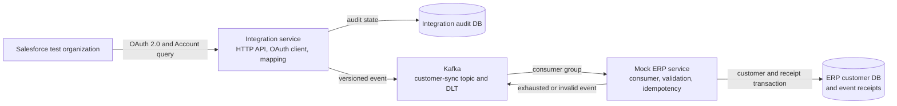

# Northstar Integration Service

Northstar is a deliberately narrow enterprise-integration portfolio project. A
request reads one designated Salesforce Account, converts it into an internal
customer, publishes a versioned Kafka event, and stores the customer in a mock
ERP backed by PostgreSQL.

The repository demonstrates implemented OAuth 2.0 and REST client boundaries,
mapping and validation, asynchronous delivery, idempotent persistence, bounded
retry, dead-letter recovery, audit state, safe operational logs, and health
checks. It is a learning project, not a production Salesforce connector.

## Architecture



The two services are separate Java 21 Spring Boot applications and Maven
modules. They share local Kafka and PostgreSQL infrastructure, but they own
separate databases and never query each other's tables.

- `integration-service` owns the HTTP trigger, Salesforce access, mapping,
  customer validation, Kafka publication, and publication audit.
- `mock-erp-service` owns Kafka consumption, ERP validation, create-or-update
  persistence, exact-event deduplication, retry, and dead-letter routing.
- Kafka topic `northstar.customer-sync.v1` carries version-one customer events;
  `northstar.customer-sync.v1.DLT` preserves terminal consumer failures.
- PostgreSQL database `integration_service` stores publication audit records;
  `mock_erp` stores ERP customers and successful event receipts.

## Prerequisites

- Java 21 (`java -version`)
- Docker with Docker Compose
- Bash-compatible shell for the examples
- A Salesforce test organization and designated Account with `Business_ID__c`

The Maven Wrapper is included; a separate Maven installation is unnecessary.

## Configure Salesforce and local infrastructure

Create the ignored local configuration file:

```bash
cp .env.example .env
```

Replace every `replace-with-...` value. The Salesforce client app requires the
OAuth 2.0 Client Credentials flow and permission to read the designated test
Account. Use its token endpoint, client ID, client secret, REST API version, and
the Account ID. Never commit `.env`, credentials, access tokens, private
instance URLs, or copied customer payloads.

The PostgreSQL role in `PG_USERNAME`/`PG_PASSWORD` owns the local `mock_erp`
database. Use the same real values for `INTEGRATION_DB_USERNAME` and
`INTEGRATION_DB_PASSWORD`; the Compose initialization creates the separate
`integration_service` database. Environment variables already exported by the
shell take precedence over `.env` values.

Load the file before running either application:

```bash
set -a
source .env
set +a
```

## Build and run

Verify formatting, tests, and executable packaging from the repository root:

```bash
./mvnw verify
```

Start fresh local dependencies and confirm they are ready:

```bash
docker compose up -d broker postgres
docker compose ps
```

Then start each service in its own configured shell:

```bash
# terminal 1
set -a; source .env; set +a
CUSTOMER_SYNC_LISTENER_ENABLED=true SERVER_PORT=8081 \
  ./mvnw -pl mock-erp-service spring-boot:run
```

```bash
# terminal 2
set -a; source .env; set +a
./mvnw -pl integration-service spring-boot:run
```

The mock ERP listener is disabled by default to prevent accidental message
consumption. It must be enabled explicitly for the end-to-end flow.

Check dependency-aware readiness:

```bash
curl -sS http://localhost:8080/actuator/health/readiness
curl -sS http://localhost:8081/actuator/health/readiness
```

Both should return `{"status":"UP"}`. Only health endpoints are exposed;
details, credentials, broker addresses, and database metadata are suppressed.

## Trigger and inspect a synchronization

```bash
curl -i -X POST \
  "http://localhost:8080/api/sync/account/$SALESFORCE_TEST_ACCOUNT_ID"
```

A `202 Accepted` response contains only the Salesforce Account ID, event ID,
correlation ID, and `ACCEPTED`. It proves Kafka acknowledged the event, not that
the ERP transaction has completed.

Use the returned correlation ID to inspect the integration-owned audit:

```bash
CORRELATION_ID=replace-with-returned-correlation-id
curl -sS "http://localhost:8080/api/sync/$CORRELATION_ID"
```

`PUBLISHED` proves publication. A mock ERP processing receipt or the safe
`customer_sync_succeeded` log proves downstream completion. See
[docs/VERIFICATION.md](docs/VERIFICATION.md) for the complete reproducible
checklist and [docs/OBSERVABILITY.md](docs/OBSERVABILITY.md) for how to
interpret every outcome.

## Delivery and recovery behavior

Events use `businessId` as the Kafka key for per-customer partition ordering.
ERP customers are uniquely identified by Salesforce `sourceCustomerId`, so a
new event updates the existing row instead of creating a duplicate. A unique
`eventId` receipt makes redelivery of an already committed event a no-op.

Validation failures are not retried. Other failures receive three total
attempts with a one-second fixed backoff by default. Terminal records retain
their original key and payload in the DLT with a safe `VALIDATION` or
`RETRY_EXHAUSTED` category; exception messages and stack traces are omitted.
Diagnosis and controlled replay are documented in
[docs/OPERATIONS.md](docs/OPERATIONS.md).

## Testing

`./mvnw verify` runs focused unit and MVC tests, stubbed Salesforce HTTP tests,
serialization contracts, embedded-Kafka tests, and PostgreSQL integration tests
using Testcontainers. Default verification never requires Salesforce.

Live Salesforce smoke tests are opt-in and must only target designated read-only
test data. The exact commands and final release evidence are kept in
[docs/VERIFICATION.md](docs/VERIFICATION.md).

## Limitations and future work

- Synchronization is manually triggered; Salesforce change-data capture is not
  implemented.
- Only one Account shape and event-contract version are supported.
- OAuth tokens are requested per flow; token caching is intentionally deferred.
- Kafka and PostgreSQL use single-node local development infrastructure.
- There is no schema registry, distributed tracing, authentication on the local
  trigger, cloud deployment, or production operations model.
- Integration audit reports publication only. Downstream success and DLT
  evidence remain correctly owned by the mock ERP and Kafka rather than being
  combined into a misleading distributed status.

The ordered implementation history and scope decisions are in
[docs/ROADMAP.md](docs/ROADMAP.md) and [docs/PROJECT_BRIEF.md](docs/PROJECT_BRIEF.md).

## AI-assisted development disclosure

This project was built through an AI-assisted mentoring workflow. The learner
made architectural decisions, implemented and reviewed slices, and used AI for
explanations, code review, debugging, documentation, and explicitly requested
implementation help. Portfolio claims should be limited to behavior verified
by the repository's tests and the release checklist.

## Evidence-based portfolio wording

- Built a two-service Java 21/Spring Boot integration that reads designated
  Salesforce Account data through OAuth 2.0, publishes versioned Kafka events,
  and persists idempotent customer updates in PostgreSQL.
- Implemented bounded Kafka retry, dead-letter routing, transactional event
  receipts, publication audit state, correlated safe logging, and
  dependency-aware health probes.
- Verified the system with stubbed external-HTTP tests, MVC and unit tests,
  embedded Kafka, Testcontainers PostgreSQL, and a reproducible live
  trigger-to-database release checklist.

These claims describe the local/test MVP. They do not claim production traffic,
cloud deployment, Salesforce change-data capture, or a real ERP integration.
